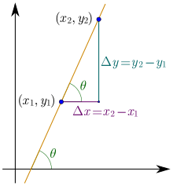
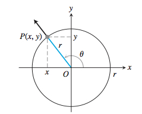
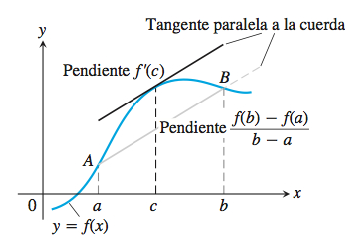
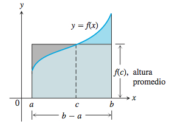

# Conceptos de Analisis Matemático I

## Producto Cartesiano

Si $A$ y $B$ son dos conjuntos no
vacı́os, entonces el producto cartesiano $A \times B$ de $A$ y $B$ se define como:
$$
A \times B := \{(a, b) : a \in A, b \in B\}
$$

## Pendiente de una recta

La pendiente $m$ de una recta es la siguiente:
$$
m = tan \theta = \frac{\Delta y}{\Delta x}= \frac{y_{2} - y_{1}}{x_{2}-x_{1}}
$$

## Función

Sean $A$ y $B$ conjuntos de números reales. Una función f es un
subconjunto de $A \times B$, tal que: si $(a, b) \in f$ y $(a, c) \in f$ , entonces $b = c$.
El **dominio** de $f$ es el conjunto de todos los $a \in A$ tales que existe $b \in B$
con la propiedad: $(a, b) \in f$ . La **imagen** de $f$ es el conjunto de los $b \in B$
tales que existe $a \in A$ con $(a, b) \in f$. El **conjunto de llegada o**
**codominio** de $f$ es el conjunto $B$.

### Clasificaciones

#### Funciones par:

Una función $y = f (x)$ es par si $f (x) = f (-x)$ para todo x en el
dominio de $f$ .

Ejemplo: $f(x) = x^{2}$

#### Funciones impar:

Una función $y = f (x)$ es par si $f (x) = -f (-x)$ para todo x en el
dominio de $f$ .

Ejemplo: $f(x) = x^{3}$

#### Función afín:

Cumple con la forma:
$$
f(x) =mx + b
$$
Donde $m$ y $b$ son números reales. El gráfico de una función afín es una recta en la que $m$ es la pendiente y $b$ es la ordenada al origen.

#### Funciones polinómicas:

Cumplen con la forma:
$$
P(x) = a_{n}x^{n}+a_{n-1}x^{n-1}+ ... +a_{1}x+a_{0} 
$$

#### Funciones racionales:

Son cocientes de funciones polinómicas.

$$
R(x) =  \frac{P(x)}{Q(x)}\ ,\ \ x \in D_{R}
$$

Donde $P$ y $Q$ son funciones polinómicas y $Q(x) \neq 0$

#### Función de valor absoluto:

Se denomina de la siguiente manera:
$$
|x| = \begin{cases}
x, si\ x \ge 0 \\
-x, si\ x \le 0
\end{cases}
$$

#### Funciones trigonométricas:

Son funciones de $\theta$ en las que $\theta$ es un angulo en radianes.

$ sen(\theta) = \frac{y}{r}$

$ cos(\theta) = \frac{x}{r}$

$ tan(\theta) = \frac{y}{x}$

etc.

### Operaciones:

#### Suma:

$$
(f+g)(x)= f(x) + g(x)
$$

Dominio:  $D(f) \cap D(g)$

#### Diferencia

#### 

$$
(f-g)(x)= f(x) - g(x)
$$

Dominio:  $D(f) \cap D(g)$

#### Multiplicación:

#### 

$$
(f·g)(x)= f(x)·g(x)
$$

Dominio:  $D(f) \cap D(g)$

#### División:

Ver función racional

#### Composición:

$$
(f \circ g) = f(g(x))
$$

Domicio: $D(f\circ g) = \{x \in D(g):g(x) \in D(f)\}$

### Utiliza:

- Producto Cartesiano

## Tasa de cambio promedio

La tasa de cambio promedio de una función $y = f (x)$ con respecto a la
variable $x$ en el intervalo $[x 1 , x 1 + h]$ es:
$$
\frac{\Delta y}{\Delta x}= \frac{f(x_{1}+h)-f(x_{1})}{h}
$$

### Utiliza:

- Función
- Pendiente de una recta

## Distancia

Sean $a$ y $b$ números reales. Las distancia $d(a,b)$ entre $a$ y $b$ se define por:
$$
d(a,b) = |a-b|
$$

## Límite

$$
\forall \epsilon > 0\ \exists \delta >0\ /\ 0<|x+x_{0}|<\delta =>|f(x)-L|<\epsilon
$$

Decimos que $f$ tiende a $L$ cuando $x$ tiende a $x_{0}$, y escribimos:

$$
\lim_{x→c}f(x)  = L
$$
si y solo si para cada $\epsilon > 0$, existe $\delta > 0$ tal que:

$$
|f(x)-L|<\epsilon
$$

para toda x en el dominio de $f$ tal que $0 < |x-x_{0}|<\delta$

### Operaciones:

Si $\lim_{x→c}f(x)$ y $\lim_{x→c}g(x)$ existen.

Entonces:

- $\lim_{x→c}(f(x)+g(x)) = \lim_{x→c}f(x) + \lim_{x→c}g(x)$
- $\lim_{x→c}(f(x)-g(x)) = \lim_{x→c}f(x) + \lim_{x→c}g(x)$
- Si $k \in \mathbb{R}$, entonces $\lim_{x→c}(k·f(x)) = k·\lim_{x→c}f(x)$
- $\lim_{x→c}(f(x)·g(x)) = \lim_{x→c}f(x)·\lim_{x→c}g(x)$
- Si $\lim_{x→c}f(x) \neq 0$, entonces $\lim_{x→c} \frac{f(x)}{g(x)} = \frac{\lim_{x→c}f(x)}{\lim_{x→c}g(x)}$

### Utiliza:

- Función
- Distancia

## Discontinuidad

Si una función $f$ no es continua en un punto $c$, entonces decimos que $f$ es discontinua en $c$ y que $c$ es un punto de discontinuidad de $f$.

### Clasificaciones

#### Evitable:

$f(c)$ y $\lim_{x→c}f(x)$ existen pero $f(c) \neq \lim_{x→c}f(x)$

#### Discontinuidad de salto:

$\lim_{x→c}f(x)$ no existe, pero $\lim_{x^{-}→c}f(x)$ y $\lim_{x^{+}→c}f(x)$ existen.

#### Discontinuidad esencial:

Al menos uno de los límites laterales no existe.

$\lim_{x^{-}→c}f(x)$ o $\lim_{x^{+}→c}f(x)$ no existe.

### Utiliza:

- Función
- Límite

## Teorema del valor intermedio

Sea $f:[a,b] \rightarrow \mathbb{R}$ una función continua en $[a,b]$. Sea $y_{0}$ un número real entre $f(a)$ y $f(b)$. Entonces, existe $c \in [a,b]$ tal que:
$$
f(c) = y_{0}
$$

### Utiliza:

- Función

## Asíntota

Es una recta que no cruza a la función en ningún punto de su dominio.

### Clasificación

#### Asíntota horizontal:

Decimos que la recta horizontal $y = b$ es una asíntota horizontal de la función y = f(x) si:
$$
\lim_{x→+\infin}f(x) = b
$$
o:
$$
\lim_{x→-\infin}f(x) = b
$$

#### Asíntota vertical:

Decimos que $x=a$ es una asíntota vertical de la función $y=f(x)$ si:
$$
\lim_{x^{-}→a}f(x) = \pm\infin
$$

$$
\lim_{x^{-}→a}f(x) = \pm\infin
$$

#### Asíntota oblicua:

Una recta $y = ax + b$, con $a \neq 0$ es una asíntota oblicua de la función $y = f(x)$ si:
$$
\lim_{x→\pm\infin}[f(x) - (ax+b)]= 0
$$

### Utiliza:

- Función
- Límite

## Tasa de cambio instantánea

La tasa de cambio instantánea es la tasa de cambio promedio de una función cuando la longitud $h$ del intervalo considerado tiende a 0.
$$
\lim_{h→0} \frac{f(x_{1}+h)-f(x_{1})}{h}
$$

### Utiliza:

- Función
- Tasa de cambio promedio

## Derivada

La derivada es una función $f'(x)$ que para cada valor de $x$ su imagen es la tasa de cambio instantánea de la función original $f(x)$ en ese valor de $x$

Se obtiene de la siguientes maneras:
$$
f'(x) = \lim_{h→0} \frac{f(x_{0}+h)-f(x_{0})}{h}
$$

$$
f'(x) = \lim_{z→x} \frac{f(z)-f(x)}{z-x}
$$

Notación alternativa: $y'(x)$, $\frac{df}{dy}(x)$

### Propiedades:

- Si $f$ es derivable en $x=c$, entonces $f$ es continua en $c$

- Si $f(x) = c$ para todo $x$, entonces $f'(x) =0$ para todo $x$

- Si $n \in \mathbb{R}$ y $f(x) = x^{n}$, entonces $f'(x) =nx^{n-1}$ para todo $x$ donde $x^{n}$ y $x^{n-1}$ estén definidas

- Si $f$ es derivable en $c$ y si $k \in \mathbb{R}$, entonces $(kf)'(c)=kf'(c)$

- Si $f$ y $g$ son derivables en $c$, entonces $f+g$ y $f·g$  son derivables en c y además:

  - $(f+g)'(c)=f'(c)+g'(c)$
  - $(f·g)'(c)=f'(c)g(c)+f(c)g'(c)$

- Si $f$ y $g$ son derivables en $c$ y $g(c)\neq 0$, entonces $f/g$ es derivable en $c$ y además:
  $$
  (\frac{f}{g})'(c)= \frac{f'(c)g(c)-f(c)g'(c)}{g(c)^{2}}
  $$

### Utiliza:

- Función
- Tasa de cambio instantánea
- Límite

## Regla de la cadena

Si $g$ es derivable en $c$ y $f$ es derivable en $g(c)$, entonces $f \circ g$ es derivable en $c$ y además:
$$
(f\circ g)'(c) = f'(g(c))·g'(c)
$$

### Utiliza:

- Derivada

## Derivada lateral

Sea $c$ un número real. La derivada por derecha de $f$ en $c$ se define como:
$$
\lim_{h→0^{+}} \frac{f(c+h)-f(c)}{h}
$$
La derivada por izquierda de $f$ en $c$ se define como:
$$
\lim_{h→0^{-}} \frac{f(c+h)-f(c)}{h}
$$
En ambos casos el límite debe existir.

### Utiliza:

- Derivada

## Derivación implícita

Cuando no se tiene una función de la forma $y=f(x)$ se puede utilizar este método para derivar.

El método consiste en tomar las derivadas de todos los elementos como funciones de $x$ individuales y luego aislar el término de $y'$, que es la derivada de la función.

### Utiliza:

- Derivada

## Linealización

Sea $f$ una función derivable en $x=a$. Definimos la linealización de $f$ en $a$ como la función:
$$
L(x) = f'(a)(x-a)+f(a)
$$
En general, cerca del punto $a$, la linealización es una buena aproximación de la función $f$.

### Utiliza:

- Derivada
- Función

## Diferenciales

Representan un cambio en el valor de $y$ de la linealización de una función en un punto con respecto a un cambio en $x$.
$$
\Delta L = f'(a)dx
$$

$$
dy = f'(a)dx
$$

### Utiliza:

- Linealización

## Máximos y mínimos

Sea $f$ una función con dominio $D$. Decimos que $f$ tiene un máximo
absoluto en $D$ en el punto $c \in D$ si:
$$
f (x) \leq f(c)
$$
para todo $x$ en $D$. De forma análoga, decimos que $f$ tiene un mínimo
absoluto en $D$ en el punto $c$ si:
$$
f (x) \geq f (c)
$$
para todo $x$ en $D$.

### Utiliza:

- Función

## Teorema de los valores extremos para funciones continuas

Si $f : [a, b] → \mathbb{R}$ es continua en $[a, b]$, entonces existen puntos $x_{1} \in [a, b]$ y
$x \in [a, b]$ tales que:
$$
f (x_{1}) = max_{x\in [a,b]} f(x)
$$
y  
$$
f(x_{2}) = min_{x\in [a,b]} f(x).
$$
En otras palabras, una función continua en un intervalo cerrado y
acotado alcanza su valor mínimo absoluto y su valor máximo
absoluto en $[a, b]$.

### Utiliza:

- Función

## Extremos locales o relativos

Sea $f$ una función definida en un dominio $D$. Decimos que $f$ tiene un
máximo local o relativo en el punto $c$ si existe un intervalo abierto
$(c - r , c + r )$ centrado en $c$ tal que:
$$
f (x)  \leq  f (c)
$$
para todo $x$ que pertenezca a $D$ y a $(c - r , c + r )$. De forma similar,
decimos que $f$ tiene un mínimo local o relativo en el punto $c$ si existe un
intervalo abierto $(c - r , c + r )$ centrado en $c$ tal que:
$$
f (x) \geq f (c)
$$
para todo $x$ que pertenezca a $D$ y a $(c - r , c + r )$.

### Utiliza:

- Función

- Máximos y mínimos

## Punto crítico

Son puntos en el dominio de una función en los que:

- $f'(x) = 0$
- $f'(x)$ no existe
- Puntos en los extremos del dominio de $f$

### Utiliza:

- Función
- Derivada

## Teorema de Rolle

Sea $f$ una función continua en $[a,b]$ y derivable en $(a, b)$. Suponiendo que:
$$
f(a) = f(b)
$$
Entonces existe $c$ en $(a,b)$ que:
$$
f'(c) =0
$$

### Utiliza:

- Derivada
- Función

## Teorema del valor medio

Sea $f$ una función continua en $[a,b]$ y derivable en $(a,b)$. Entonces, existe $c$ en $(a,b)$ tal que:
$$
f'(c)= \frac{f(b)- f(a)}{b-a}
$$

### Consecuencias:

- Sea $f$ una función continua en $[a, b]$ y derivable en $(a, b)$ tal que:
  $$
  f'(x) = 0
  $$
  para todo $x$ en $(a, b)$. Entonces $f$ es una función constante en $[a, b]$.

- Si $f$ y $g$  son funciones continuas en $[a,b]$ y derivables en $(a,b)$ tales que:
  $$
  f'(x) = g'(x)
  $$
  Entonces:
  $$
  \forall x \in (a,b)\ \  \exists\ C \ \ /\ \ g(x) = f(x) + C
  $$

### Utiliza:

- Función
- Pendiente de una recta
- Derivada

## Funciones crecientes y decrecientes

Sea $f$ una función continua en $[a,b]$ y derivable en $(a,b)$. Entonces:

- Si $f'(x) > 0$ para todo $x$ en $(a,b)$, entonces $f$ es creciente en $[a,b]$
- Si $f'(x) < 0$ para todo $x$ en $(a,b)$, entonces $f$ es decreciente en $[a,b]$

### Utiliza:

- Función
- Derivada

## Concavidad

Sea $f$ una función derivable en $(a,b)$. Tenemos:

- Si $f'$ es creciente en $(a,b)$, entonces decimos que $f$ es cóncava hacia arriba en $(a,b)$
- Si $f'$ es decreciente en $(a,b)$, entonces decimos que $f$ es cóncava hacia abajo en $(a,b)$

Si f es dos veces derivable en (a,b):

- Si $f'' > 0$ en $(a,b)$, entonces decimos que $f$ es cóncava hacia arriba en $(a,b)$
- Si $f'' < 0$ en $(a,b)$, entonces decimos que $f$ es cóncava hacia abajo en $(a,b)$

### Utiliza:

- Función
- Derivada
- Funciones crecientes y decrecientes

## Punto de inflexión

Sea $f$ una función continua en $(a, b)$ y sea c un punto de ese intervalo.
Decimos que $(c, f (c))$ es un punto de inflexión de f si es posible trazar la
recta tangente al gráfico de f en el punto $(c, f (c))$, y si la gráfica de f
cambia de concavidad en $(c, f (c))$.

En los puntos de inflexión se cumple que $f''(c)$ no existe o bien que $f''(c)=0$

### Utiliza:

- Función
- Derivada

## Antiderivada (Integral indefinida)

Decimos que una función F es una antiderivada de $f$ en $(a,b)$ si:

$$
\forall x \in (a,b)\ /\ F'(x) = f(x)
$$

Por consecuencia del teorema del valor medio, dos antiderivadas de una función difieren en una constante.

Notación:
$$
\int f(x)dx
$$
De esta forma se representa a la antiderivada general de $f$ en $(a,b)$ y se denomina integral indefinida de $f$

### Propiedades

- $\int f(x) + g(x)dx = \int f(x)dx + \int g(x)dx$
- $\int f(x) - g(x)dx = \int f(x)dx - \int g(x)dx$
- $\int cf(x)dx = c\int f(x)dx$

### Utiliza:

- Función

- Derivada
- Teorema del valor medio

## Sumas finitas

Se expresan de la siguiente manera:
$$
\sum_{k=1}^{n}a_{k} = a_{1} + a_{2} + ... + a_{n}
$$

### Propiedades:

$$
\sum_{k=1}^{n}(a_{k} + b_{k}) = \sum_{k=1}^{n}a_{k} + \sum_{k=1}^{n}b_{k}
$$

$$
\sum_{k=1}^{n}(a_{k} - b_{k}) = \sum_{k=1}^{n}a_{k} - \sum_{k=1}^{n}b_{k}
$$

$$
\sum_{k=1}^{n}c·a_{k} = c·\sum_{k=1}^{n}a_{k}
$$

$$
\sum_{k=1}^{n}c = n*c
$$

$$
\sum_{k=1}^{n}k = \frac{n(n+1)}{2}
$$

## Partición de un intervalo

Si $I=[a,b]$ es un intervalo, una partición $P$ de $I$ es una colección de puntos distintos: $x_{0}, x_{1},...,x_{n}$ con la propiedad:
$$
a = x_{0} < x_{1} < ... < x_{n} = B
$$
Se escribe: $P = \{x_{0}, x_{1},...,x_{n}\}$

Una partición $P$ se utiliza para dividir un intervalo $[a,b]$ en subintervalos:
$$
[a,x_{1}], [x_{1},x_{2}],...,[x_{n-1},b]
$$

## Sumas de Riemman

Sea $f : [a, b] → \mathbb{R}$, $f (x) \geq 0$ para todo $x \in [a, b]$. Tomemos:
$$
P = {x 0 , x 1 , x 2 , ..., x n }
$$
una partición del intervalo $[a, b]$. Seleccionamos puntos $c 1 , c 2 , c 3 , ..., c n $:
$$
c_{1} \in [x_{0},x_{1}]
$$

$$
c_{2} \in [x_{1},x_{2}]
$$

$$
...
$$

$$
c_{n} \in [x_{n-1},x_{n}]
$$

La suma:
$$
S(f , P) = f (c_{1} )\Delta x_{1} + f (c_{2} )\Delta x_{2} + ... + f (c_{n} )\Delta x_{n} = \sum_{k=1}^{n}f(c_{k})\Delta x_{k}
$$
se denomina suma de Riemann de $f$ en $[a, b]$ con respecto a $P$.

### Utiliza:

- Sumas finitas
- Partición de un intervalo

## Integral definida

Sea $f : [a, b]→ \mathbb{R}, f \geq 0$, Decimos que el límite:
$$
\lim_{||P||→0} S(f , P) = A
$$

existe y es igual a un número $A$ si: para todo $\epsilon > 0$, existe $\delta> 0$ tal que para toda partición $P = \{x_{0} , ..., x_{n}\}$ del intervalo $[a, b]$ verificando
$||P|| < \delta$ y cualquiera sea la elección de los puntos $c_{i}$ en $[x_{i-1} , x_{i} ]$, se
tiene:
$$
|\sum_{i=1}^{n}f(c_{i})\Delta x_{i}-A|<\epsilon
$$
El número $A$ se denomina integral definida de $f$ en el intervalo $[a, b]$ y escribimos:
$$
A = \int_{a}^{b}f(x)dx
$$
En este caso, decimos que la función $f$ es integrable en $[a, b]$

Condiciones para ser integrable:

- Si $f$ es continua en el intervalo $[a,b]$, entonces $f$ es integrable en $[a,b]$
- Si $f$ tiene una cantidad finita de discontinuidades en $[a,b]$ y estas son evitables o de salto, entonces $f$ es integrable en $[a,b]$.

### Propiedades

- $\int_{a}^{a}f(x)dx = 0, \int_{a}^{b}1dx= b-a$

- $\int_{a}^{b}(f(x)+g(x))dx = \int_{a}^{b}f(x)dx + \int_{a}^{b}g(x)dx$

- $\int_{a}^{b}(f(x)-g(x))dx = \int_{a}^{b}f(x)dx - \int_{a}^{b}g(x)dx$

- $\int_{a}^{a}kf(x)dx = k\int_{a}^{a}f(x)dx$

- Si $f(x) \leq g(x)$, entonces:
  $$
  \int_{a}^{b}f(x)dx \leq \int_{a}^{b}g(x)dx
  $$

- Si $c  \in [a,b]$, entonces:
  $$
  \int_{a}^{b}f(x)dx = \int_{a}^{c}f(x)dx + \int_{c}^{b}f(x)dx
  $$

### Utiliza:

- Sumas de Riemman
- Partición de un intervalo
- Límite

## Calculo de áreas de funciones

Para funciones no negativas:

Sea $f : [a, b] → \mathbb{R}$ tal que $f (x) \geq$ 0 para todo $x \in [a, b]$. Entonces el área
de la región comprendida entre el gráfico de $f$ , las rectas $x = a, x = b$ y el
eje $x$ se define como:
$$
\int_{a}^{b} f(x)dx
$$
(siempre que la integral exista).

Para funciones arbitrarias:

- Determinamos las intersecciones del gráfico de $f$ con el eje $x$ en el intervalo $[a, b]$.
- Subdividimos $[a, b]$ usando los puntos hallados en el inciso anterior.
- Integramos $f$ sobre cada sub-intervalo.
- Sumamos los valores absolutos de las integrales calculadas en el
  apartado anterior.

### Utiliza:

- Integral definida

## Teorema del valor medio para integrales

Sea $f$ una función continua en $[a,b]$. Entonces, existe $c \in [a,b]$ tal que:
$$
f(c) = \frac{1}{b-a} \int_{a}^{b}f(x)dx
$$

$$
f(c)(b-a) = \int_{a}^{b}f(x)dx
$$

### Utiliza:

- Integral definida

## Teorema fundamental del cálculo

Sea $f$ una función continua en $[a,b]$. Sea:
$$
F(x) = \int_{a}^{x}f(t)dt,\ \ \ x \in [a,b]
$$
Entonces:
$$
F'(x)=f(x)
$$

$$
\int_{a}^{b}f(x)dx = F(b)-F(a)
$$

para todo $x \in [a,b]$

### Utiliza:

- Integral definida
- Antiderivada (Integral indefinida)
- Teorema del valor medio para integrales

## Metodo de sustitución para calcular integrales

Sean $f$ y $g$ funciones continuas en $[a,b]$. Supongamos además que $g'$ es continua en $[a,b]$. Entonces:
$$
\int f(g(x))g'(x) = \int f(u)du
$$

### Utiliza:

- Antiderivada (Integral indefinida)

## Cálculo de áreas entre curvas

Sean $f$ y $g$ funciones continuas en $[a,b]$ tales que:
$$
\forall x\in[a,b]\ \ /\ \ f(x) \geq g(x)
$$
Entonces, el área de la región comprendida entre el gráfico de ambas funciones y las rectas $x = a$ y $x= b$ es:
$$
\int_{a}^{b}[f(x)-g(x)]dx
$$
Nota: se puede aplicar lo mismo para funciones de y.

### Utiliza:

- Integral definida

## Sección transversal

Una sección transversal de un sólido $S$ es la región plana formada por la intersección de $S$ con un plano.

## Cálculo de el volumen de un sólido

### Métodos

#### Por secciones transversales

El volumen de un sólido $S$ con área de sección transversal integrable $A = A(x)$ en un intervalo $[a,b]$ , es:
$$
\int_{a}^{b}A(x)dx
$$

#### Método de discos

Para cuerpos de revolución, es un caso de el método de secciones transversales en el que la sección transversal es siempre un circulo con radio que sigue el valor de una función.

En caso de ser $x$ el eje de revolución:
$$
A(x)= \pi(f(x))^{2} \rightarrow V= \pi\int_{a}^{b}f(x)^{2}dx
$$
Para usar $y$ como eje de revolución se utiliza el mismo método pero con funciones de $y$ e integrando con respecto a $y$

#### Método de las arandelas

Este caso es similar al método de discos, pero en lugar de tener discos se tienen arandelas, con una función definiendo el radio interior $r$ de la arandela y otra definiendo el radio exterior $R$. Como sección transversal se utiliza la diferencia de las areas de los discos formados por ambos radios:
$$
A(x) = \pi R(x)^{2}-\pi r(x)^{2} \rightarrow V= \pi\int_{a}^{b}R(x)^{2}-r(x)^{2}dx
$$

#### Método de los cascarones cilíndricos

En este método, en lugar de considerar secciones transversales de un sólido, se toma un cuerpo de revolución y se lo divide en cascarones cilíndricos alrededor del eje de revolución.

El área de los cascarones cilíndricos es de:
$$
A = 2\pi·r·h
$$
En el caso de un cuerpo de revolución alrededor del eje $y$ el radio es $x$ y la altura $f(x)$.
$$
V= 2\pi\int_{a}^{b}x·f(x)dx
$$

### Utiliza:

- Integral definida
- Sección transversal

## Longitud de una curva

Sea $y=f(x)$ una función tal que $f'(x)$ es continua en $[a,b]$. Entonces la longitud de la curva $y= f(x)$ desde el punto $(a, f(x))$ al punto $(b, f(b))$ es:
$$
L=\int_{a}^{b}\sqrt{1+(f'(x))^{2}}dx
$$

### Utiliza

- Sumas de Riemman
- Integral definida

## Área de una superficie de revolución

Sea $f$ una función tal que $f(x) \geq 0 $ para todo $x$ en $[a,b]$. Supongamos que $f'$ es continua en $[a,b]$. Entonces el área de la superficie obtenida al hacer girar el gráfico de $f$ alrededor del eje $x$ es:
$$
S = 2\pi\int_{a}^{b}f(x)\sqrt{1+(f'(x))^{2}}dx
$$

### Utiliza:

- Longitud de una curva
- Integral definida

## Función inyectiva

Una función $f:D\rightarrow \mathbb{R}$ es inyectiva en $D$ si:
$$
f(a) \neq f(b)
$$
siempre que $a \in D$ , y $b \in D$, y además $a \neq b$

## Función inversa

Sea $f:D\rightarrow R$ una función inyectiva en $D$, donde $R$ es la imagen o rango de $f$. La función inversa $f^{-1}R\rightarrow D$ se define por:
$$
f(x) = y \iff f^{-1}(y) = x
$$
Las funciones inversas cumplen con la propiedad de que:
$$
f^{-1}(f(x))=x
$$

### Utiliza:

- Función
- Función inyectiva

## Derivación de funciones inversas

Pueden ser calculadas de la siguiente manera:
$$
(f^{-1})'(y) = \frac{1}{f'(f^{-1}(y))}
$$

### Utiliza:

- Función inversa
- Derivada

## Logaritmo natural

$$
ln(|x|) = \int_{1}^{|x|}\frac{1}{t}dt
$$

### Propiedades:

- $ln(1) = \int_{1}^{1}\frac{1}{t}dt=0$
- $ln'(x) = \frac{1}{x},\ \  \ \ (x>0)$
- $ln(e) = 1$

### Utiliza:

- Integral definida
- Teorema fundamental del cálculo

## Función exponencial

Es definida como la función inversa del logaritmo natural:
$$
exp(x) = e^{x} = ln^{x},\ \ \ x\in\mathbb{R}
$$

### Propiedades

- $ln(e^{x}) = x,\ \ \ \ x\in \mathbb{R}$
- $e^{ln(x)}=x,\ \ \ \ (y>0)$
- $\int e^{x}dx = e^{x}+C$
- $a^{x}:=e^{xln(a)}$
- $\frac{d}{dx}a^{x} = e^{xln(a)}·ln(a) = ln(a)·a^{x}$

### Utiliza:

- Integral indefinida
- Logaritmo natural
- Función inversa

## Derivadas de funciones trigonométricas inversas

$$
\frac{d}{dx}(sen^{-1})(x) = \frac{1}{\sqrt{1-x^{2}}},\ \ \ \ \ \ \ x\in(-1,1)
$$

$$
\frac{d}{dx}(cos^{-1})(x) = -\frac{1}{\sqrt{1-x^{2}}},\ \ \ \ \ \ \ x\in(-1,1)
$$

$$
\frac{d}{dx}(tan^{-1})(x) = \frac{1}{1+x^{2}},\ \ \ \ \ \ \ x\in\mathbb{R}
$$

### Utiliza:

- Derivación de funciones inversas
- Función

## Funciones Hiperbólicas

$$
senh(x)=\frac{e^{x}-e^{-x}}{2},\ \ \ \ \ x\in\mathbb{R}
$$

$$
cosh(x)=\frac{e^{x}+e^{-x}}{2},\ \ \ \ \ x\in\mathbb{R}
$$

$$
tanh(x) = \frac{senh(x)}{cosh(x)} = \frac{e^{x}-e^{-x}}{e^{x}+e^{-x}}\ \ \ \ \ \ x\in\mathbb{R}
$$

### Derivadas de funciones Hiperbólicas

$$
\frac{d}{dx}(cosh)(x) = senh(x),\ \ \ \ \ \ \ x\in\mathbb{R}
$$

$$
\frac{d}{dx}(senh)(x) = cosh(x),\ \ \ \ \ \ \ x\in\mathbb{R}
$$

$$
\frac{d}{dx}(tanh)(x) = \frac{1}{cosh^{2}(x)},\ \ \ \ \ \ \ x\in\mathbb{R}
$$

### Inversas de funciones Hiperbólicas

$$
\frac{d}{dx}(senh^{-1})(x) = \frac{1}{\sqrt{1+x^{2}}}
$$

$$
\frac{d}{dx}(cosh^{-1})(x) = \frac{1}{\sqrt{x^{2}-1}},\ \ \ \ \ \ \ x>1
$$

$$
\frac{d}{dx}(tanh^{-1})(x) = \frac{1}{1-x^{2}},\ \ \ \ \ \ \ |x|<1
$$

### Utiliza:

- Función exponencial
- Derivada de funciones inversas

## Cambio exponencial

Si tenemos una función $y=y(x)$ que mide una determinada magnitud en función de $x$. Si cuando $x=0$ tenemos una cantidad $y_{0}$ y la taza de cambio instantánea de $y$ con respecto a $x$ es proporcional a $y(t)$. Se puede expresar el problema de la siguiente manera:
$$
\frac{dy}{dx}(x) = ky(x)
$$

$$
y(0)=y_{0}
$$

La solución de este problema es la función:
$$
y(x) = y_{0}e^{kt}
$$

### Utiliza:

- Función exponencial
- Derivada

## Regla de L´Hopital

Supongamos que el límite:
$$
\lim_{x→a^{+}}\frac{f'(x)}{g'(x)}
$$
existe o es $+\infin$ 0 $-\infin$. Entonces:

Si $\lim_{x→a^{+}}f(x)= 0$ y $\lim_{x→a^{+}}g(x) = 0$, entonces:
$$
\lim_{x→a^{+}}\frac{f(x)}{g(x)}=\lim_{x→a^{+}}\frac{f'(x)}{g'(x)}
$$
Si $\lim_{x→a^{+}}g(x)=\pm\infin$, entonces:
$$
\lim_{x→a^{+}}\frac{f(x)}{g(x)} = \lim_{x→a^{+}}\frac{f'(x)}{g'(x)}
$$

### Utiliza:

- Límite
- Derivada

## Integración por partes

Es una técnica que se puede usar para calcular integrales de la forma:
$$
\int F(x)G(x)dx
$$
Para funciones $f$ y $g$ derivables:
$$
\int f(x)g'(x)dx = f·g-\int f'(x)g(x)dx
$$
Para integrales definidas
$$
\int_{a}^{b} f(x)g'(x)dx = f·g \biggr\rvert_{a}^{b} -\int_{a}^{b} f'(x)g(x)dx
$$

### Utiliza:

- Integral definida
- Derivada
- Antiderivada (Integral Indefinida)

## Integrales impropias

Las siguientes integrales con intervalos de integración no acotados se denominan integrales impropias de tipo I:

- Sea $f$ una función continua en $[a, +\infin)$. Entonces:

$$
\int_{a}^{\infin}f(x)dx=\lim_{b→\infin} \int_{a}^{b}f(x)dx
$$

- Sea $f$ una función continua en $(-\infin, b]$. Entonces:

$$
\int_{-\infin}^{b}f(x)dx=\lim_{a→-\infin} \int_{a}^{b}f(x)dx
$$

- Sea $f$ una función continua en $(-\infin, \infin)$. Entonces:

$$
\int_{-\infin}^{\infin}f(x)dx=\int_{-\infin}^{c}f(x)dx+\int_{c}^{\infin}f(x)dx
$$

- Sea $f$ una función continua en $(a, b]$ y discontinua en $x=a$. Entonces:

$$
\int_{a}^{b}f(x)dx=\lim_{c→a^{+}} \int_{c}^{b}f(x)dx
$$

- Sea $f$ una función continua en $[a, b)$ y discontinua en $x=b$. Entonces:

$$
\int_{a}^{b}f(x)dx=\lim_{c→b^{-}} \int_{a}^{c}f(x)dx
$$

- Si $c \in (a,b)$  y $f$ es descontinua en $c$ y continua en  $[a, c) \cap (c, b]$. Entonces:

$$
\int_{a}^{b}f(x)dx=\int_{a}^{c}f(x)dx+\int_{c}^{b}f(x)dx
$$

En cada caso, si el límite existe, decimos que la integral impropia es convergente. Si no existe, decimos que diverge.

### Utiliza:

- Integrales definidas
- Límite

## Integrales trigonométricas

Técnicas para calcular integrales de la siguiente forma:
$$
\int sen^{m}(x)·cos^{n}(x)dx,\ \ \ \ \ n,m \geq 0
$$

### Casos:

- $m$ es impar, entonces $m=2k+1$, para $k \geq 0 $.
  $$
  sen^{m}(x)=sen^{2k+1}(x)=sen^{2k}(x)·sen(x)= (sen^{2}(x))^{k}sen(x)
  $$

  $$
  (sen^{2}(x))^{k}sen(x) = (1-cos^{2}(x))^{k}·sen(x)
  $$

  

- $m$ es par y $n$ es impar, entonces $n=2k+1$, para $k\geq0$.

$$
cos^{m}(x)=cos^{2k+1}(x)=cos^{2k}(x)·cos(x)= (cos^{2}(x))^{k}cos(x)
$$

$$
(cos^{2}(x))^{k}cos(x) = (1-sen^{2}(x))^{k}·cos(x)
$$

- $m$ es par y $n$ es par, entonces:
  $$
  cos^{2}(x)=\frac{1+cos(2x)}{2}
  $$

  $$
  sen^{2}(x)=\frac{1-cos(2x)}{2}
  $$

  y calcular todo en función de $cos(2x)$

### Utiliza:

- Función
- Antiderivada (Integral indefinida)

## Sucesión

Una sucesión es una función $f: \mathbb{N} \rightarrow \mathbb{R}$ cuyo dominio son los números naturales.  Se denota de la siguiente manera:
$$
\{a_{n}\}^{\infin}_{n=1}
$$

### Utiliza:

- Función

## Convergencia de una sucesión

Si el límite
$$
\lim_{n \rightarrow \infin} a_{n}
$$
existe y es igual a $L$, entonces decimos que la sucesión $a_{n}$ converge a $L$. Si el límite no existe, decimos que la sucesión diverge.

### Propiedades:

Siendo $\{a_{n}\}$ y $\{b_{n}\}$ sucesiones de números reales, y sean $A$ y $B$ números reales. Las siguientes reglas se cumplen si $\lim_{n \rightarrow \infin} a_{n}=A$ y $\lim_{n \rightarrow \infin} b_{n}=B$

- $\lim_{n \rightarrow \infin} (a_{n} + b_{n}) = A + B$
- $\lim_{n \rightarrow \infin} (k·b_{n}) = k·B$
- $\lim_{n \rightarrow \infin} (a_{n} · b_{n}) = A · B$
- $\lim_{n \rightarrow \infin} (\frac{a_{n}}{b_{n}}) = \frac{A}{B}$ si $B\neq 0$

Si una sucesión es monótona y acotada, entonces es convergente

### Utiliza:

- Sucesión
- Sucesión monótona
- Sucesión acotada

## Calculo de límites de sucesiones mediante funciones

Si
$$
\lim_{n \rightarrow \infin} f(x)
$$
existe, entonces:
$$
\lim_{n \rightarrow \infin} f(x) = \lim_{n \rightarrow \infin} \{a_{n}\}
$$
Esto permite utilizar la regla de L´Hopital para calcular límites

### Utiliza:

- Sucesión
- Regla de L´Hopital

## Teorema de la compresión para sucesiones

Sean $\{a_{n}\}$, $\{b_{n}\}$ y $\{c_{n}\}$ sucesiones de números reales. Si $a_{n} \leq b_{n} \leq c_{n}$ se cumple para toda $n$ mayor que algún índice $N$ y si $\lim_{n \rightarrow \infin} a_{n} = \lim_{n \rightarrow \infin} c_{n} = L$, entonces también $\lim_{n \rightarrow \infin} b_{n} = L$

### Utiliza:

- Límite
- Sucesión

## Sucesiónes acotada

Decimos que una sucesión $A_{n}$ es acotada si existe $M > 0$ tal que:
$$
|a_{n}| \leq M, para\ todo\ n
$$

### Utiliza:

- Sucesión

## Sucesión monótona

Sea $a_{n}$ una sucesión. Entonces:

- decimos que $a_{n}$ es **no decreciente** si $a_{n} \leq a_{n+1}$, para todo $n$
- decimos que $a_{n}$ es **no creciente** si $a_{n} \geq a_{n+1}$ para todo $n$

Una sucesión es monótona si es no decreciente, o si es no creciente.

### Utiliza:

- Sucesión

## Serie

Si tomamos la sucesión $\{a_{n}\}$, entonces $\{s_{N}\}$ va a ser igual a la suma de los primeros $N$ elementos de $\{a_{n}\}$.

Si $\lim_{N\rightarrow \infin}s_{N}$ existe, entonces decimos que la suma de todos los elementos de $\{a_{n}\}$ es el valor límite:
$$
\sum_{n=1}^{\infin}a_{n} = \lim_{N\rightarrow \infin}s_{N}
$$

### Utiliza:

- Sucesión
- Límite
- Sumas finitas

## Serie geométrica

Son series con la siguiente forma:
$$
\sum_{n=1}^{\infin}ar^{n-1}
$$
El número $r$ recibe el nombre de razón. $r\in\mathbb{R}$

También puede ser escrita de la siguiente manera:
$$
\sum_{n=0}^{\infin}ar^{n}
$$

### Propiedades:

Si $|r|<1$, entonces:
$$
\lim_{n\rightarrow\infin}s_{n} = \lim_{n\rightarrow\infin}(\frac{a}{1-r} - \frac{ar^{n}}{1-r}) = \frac{a}{1-r}
$$

$$
\sum_{n=1}^{\infin}ar^{n-1}=\frac{a}{1-r}
$$

Si $|r|>1$, la serie diverge.

- Se pueden realizar operaciones de suma, resta y multiplicación por constantes entre series que convergen.

### Utiliza:

- Serie
- Límite

## Criterios de convergencia para series

#### Criterio del término n-ésimo

Si la serie
$$
\sum_{n=1}^{\infin}a_{n}
$$
converge, entonces:
$$
\lim_{n\rightarrow\infin}a_{n}=0
$$
De lo contrario, si el límite no es cero o no existe, la serie diverge.

**Nota: **Este criterio no implica que si el límite es 0 entonces la serie diverge o converge.

#### Criterio de la integral

Sea $a_{n}$ una sucesión de términos positivos tal que:
$$
a_{n}=f(n)
$$
donde $f:[1,\infin)\rightarrow\mathbb{R}$ es una función positiva, decreciente y continua para todo $x\geq1$. Entonces:

- Si $\int_{1}^{\infin}f(c)dx$ converge, entonces $\sum_{n}a_{n}$ converge.
- Si $\int_{1}^{\infin}f(c)dx$ diverge, entonces $\sum_{n}a_{n}$ diverge.

#### Criterio de comparación

Sean $a_{n}$, $b_{n}$ y $c_{n}$ sucesiones de términos no negativos. Supongamos que:
$$
a_{n}\leq b_{n}\leq c_{n}
$$
para todo $n\geq 1$

Entonces:

- S $\sum_{n}c_{n}$ converge, entonces $\sum_{n}b_{n}$ converge.
- Si $\sum_{n}a_{n}$ diverge, entonces $\sum_{n}b_{n}$ diverge.

**Nota: **este criterio se utiliza para series de términos no negativos

#### Criterio de la convergencia absoluta

Decimos que una serie $\sum_{n}a_{n}$ converge absolutamente si:
$$
\sum_{n}|a_{n}|
$$
es una serie convergente

Si una serie converge absolutamente, entonces converge

#### Criterio de la razón

Sea $\sum_{n}a_{n}$ una serie dada.  Sea:
$$
\rho = \lim_{n\rightarrow\infin}|\frac{a_{n+1}}{a_{n}}|
$$
Entonces:

- Si $\rho < 1$, entonces la serie converge.
- Si $\rho > 1$, entonces la serie diverge.
- Si $\rho = 1$, entonces el criterio no decide

#### Criterio de la raíz

Sea $\sum_{n}a_{n}$ una serie dada.  Sea:
$$
\rho = \lim_{n\rightarrow\infin}\sqrt[n]{|a_{n}|}
$$
Entonces:

- Si $\rho < 1$, entonces la serie converge.
- Si $\rho > 1$, entonces la serie diverge.
- Si $\rho = 1$, entonces el criterio no decide

#### Criterio de Leibniz para series alternantes

$$
\sum_{n=1}^{\infin}(-1)^{n+1}u_{n}
$$

Esta serie alternante converge si se satisfacen las siguientes condiciones:

- Todo los términos $u_{n}$ son positivos
- $u_{n}$ es una sucesión decreciente.
- $u_{n}\rightarrow 0$ cuando $n \rightarrow\infin$

### Utiliza:

- Serie
- Integrales impropias
- Límite

## Series de Taylor

Son una herramienta para obtener aproximaciones de una función $f$ cerca de un valor $a$.

Se supone que:
$$
f(x)=\sum_{n=0}^\infin a_n(x-a)^n = a_0 +a_1(x-a)+...
$$
para $|x-a| < R$, es decir una radio $R$ alrededor del punto $a$.

Entonces se elige una sucesión $a_n$ tal que las derivadas de la serie sean iguales a las derivadas de la función en $a$
$$
a_n = \frac{f^{(n)}(a)}{n!}
$$
Por lo que la serie sería:
$$
\sum_{n=0}^\infin\frac{f^{(n)}(a)}{n!}(x-a)^n
$$

Y la función:
$$
f(x) \approx \sum_{n=0}^\infin\frac{f^{(n)}(a)}{n!}(x-a)^n
$$
Para valores de $x$ dentro de un intervalo $I$ definido por el radio $R$.

### Utiliza:

- Serie
- Función
- Derivada

## Convergencia de una serie de Taylor

Si $f$ tiene derivadas de todos los órdenes en un intervalo $I$ que contiene a
un punto a en su interior, entonces para cada $x \in I$ y cada $n \in N$, existe
$c_n$ entre $a$ y $x$ tal que:
$$
f(x) = f(a) + f'(a)(x-a) + \frac{f^{(2)}(a)}{2!}(x-a)^2 + \frac{f^{(3)}(a)}{3!}(x-a)^3 + ... + \frac{f^{(n)}(a)}{n!}(x-a)^n + \frac{f^{(n+1)}(c_n)}{(n+1)!}(x-a)^{n+1}
$$
El último término se denomina residuo o resto de orden $n$
$$
R_n(x)= \frac{f^{(n+1)}(a)}{(n+1)!}(x-a)^{n+1}
$$
Por lo tanto, se puede decir:
$$
f(x) = P_n(x)+R_n(x)
$$
Donde $P_n$ es el polinomio de Taylor de la función.

Condición para convergencia de una serie de Taylor:

Si para todo $x$ en un intervalo $I$ que contiene a $a$ se cumple que:
$$
\lim_{n\rightarrow\infin}R_n(x)=0
$$
entonces se cumple que:
$$
f(x) = \sum_{n=0}^\infin\frac{f^{(n)}(a)}{n!}(x-a)^n
$$

### Utiliza:

- Series de Taylor
- Límite

## Derivadas de una serie de Taylor

Si tenemos una serie de Taylor tal que:
$$
f(x)=\sum_{n=0}^\infin a_n(x-a)^n = a_0 +a_1(x-a)+a_2(x-a)^2+...
$$
para un intervalo $I$, entonces $f$ es derivable en ese intervalo derivando término a término la serie de Taylor.
$$
f'(x)=\sum_{n=1}^\infin na_n(x-a)^{n-1} = a_1 + 2a_2(x-a) + 3a_3(x-a)^2+...
$$

### Utiliza:

- Series de Taylor
- Derivada

## Integral de una serie de Taylor

Si tenemos una serie de Taylor tal que:
$$
f(x)=\sum_{n=0}^\infin a_n(x-a)^n = a_0 +a_1(x-a)+a_2(x-a)^2+...
$$
para un intervalo $I$, entonces $f$ es integrable en ese intervalo integrando término a término la serie de Taylor.
$$
\int f(x)dx=\int \sum_{n=0}^\infin a_n(x-a)^n dx= \sum_{n=0}^\infin a_n\int(x-a)^n dx= \sum_{n=0}^\infin \frac{a_n}{n+1}(x-a)^{n+1} + C
$$

### Utiliza:

- Series de Taylor
- Integral

## Curva plana

Sean $f=f(t)$ y $g=g(t)$ funciones continuas de $t$ en un intervalo $I$

Entonces las ecuaciones:
$$
x=f(t)
$$

$$
y=g(t)
$$

$$
t\in I
$$

se denominan ecuaciones paramétricas y se dice que $t$ es el parámetro. El intervalo $I$ se denomina dominio paramétrico. El conjunto de puntos $(x(t), y(t))$ cuando $t$ varía en el intervalo $I$ es el gráfico de las ecuaciones paramétricas. Las ecuaciones paramétricas junto al gráfico de dichas ecuaciones se denomina curva plana.

### Utiliza:

- Función

## Curva suave

Una curva $C$ representada por las ecuaciones paramétricas $x=f(t)$ y $y=g(t)$ para $t\in I$, se dice que es suave si $f'$ y $g'$ existen, con continuas en $I$ y no son simultáneamente nulas en $I$.

### Utiliza:

- Curva plana

## Longitud de una curva plana en forma paramétrica

Sea $C$ una curva suave, representada por las ecuaciones:
$$
x=f(t),\ \ \ y=g(t),\ \ \ t\in[a,b]
$$
tal que $C$ se recorre una vez conforme $t$ varía de $t=a$ a $t=b$. Entonces la longitud de la curva $C$ es:
$$
L=\int_a^b \sqrt{f'(t)^2+g'(t)^2}dt
$$

### Utiliza:

- Curva plana
- Integral definida